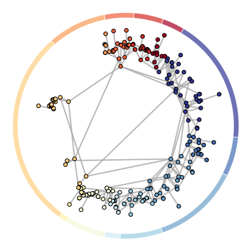

# dyvider

**dyvider** is a small library implementing dynamic programming algorithms for exact linear clustering in networks.
Its algorithms process networks whose nodes have positions in one dimension, and return their optimal partition.

The theory and experiments exploring this code can be found in the paper [\"Fast and exact linear clustering of networks with dynamic programming\"](), by [Alice Patania](https://alpatania.github.io/), [Antoine Allard](https://antoineallard.github.io/) and [Jean-Gabriel Young](https://jg-you.github.io/). 





## Dependencies

The only necessary dependency is [`networkx`](https://networkx.org/). 

    pip install networkx


## Quick tour

The following minimal example first assigns scores to nodes with a one-dimensional spectral embedding and then retrieves an optimal linear clustering from this embedding using `dyvider`.

```python
import networkx as nx
import dyvider as dy

# create a graph
g = nx.stochastic_block_model([10, 10], [[0.5, 0.05], [0.05, 0.5]])

# generate a 1-d embedding with the leading eigenvector of the modularity matrix
eigenvals, eigvenvecs = np.linalg.eig(nx.linalg.adjacency_matrix(g).todense())
score = {v: float(eigvenvecs[v, 0]) for v in g.nodes()}

# set the node positions
nx.set_node_attributes(g, score, 'score')

# run dyvider
g = dy.utilities.preprocess(g)
objective_function = dy.objectives.Modularity()
solution, Q = dy.algorithms.run(g, objective_function)

print(solution)
>>> [[0, 1, 2, 3, 4, 5, 6, 7, 8, 9]; [10, 11, 12, 13, 14, 15, 16, 17, 18, 19]] 
```

Our [tutorial](tutorial.ipynb) goes into more detail and demonstrates all the API calls.


## Paper

If you use this code, please consider citing:

"[*Fast and exact linear clustering of networks with dynamic programming*]()"<br/>
[Alice Patania](https://alpatania.github.io/), [Antoine Allard](https://antoineallard.github.io/) and [Jean-Gabriel Young](https://jg-you.github.io/). <br/>
arXiv (2023) <br/>


## Author information

Code by [Jean-Gabriel Young](https://jg-you.github.io). Don't hesitate to get in touch at <jean-gabriel.young@uvm.edu>, or via the [issues](https://github.com/jg-you/dyvider/issues)!
